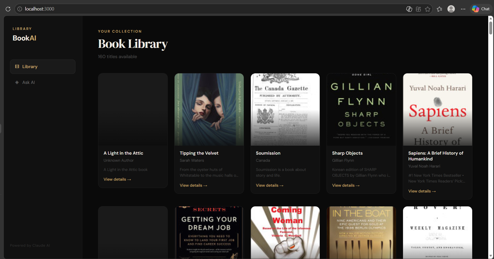
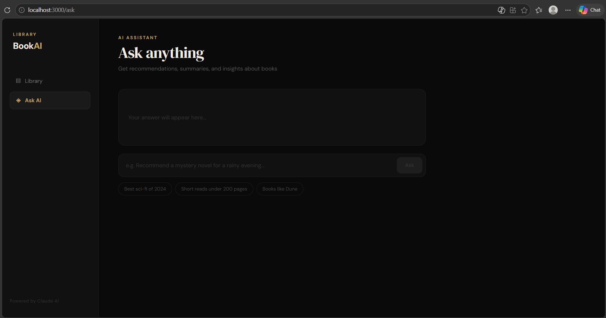
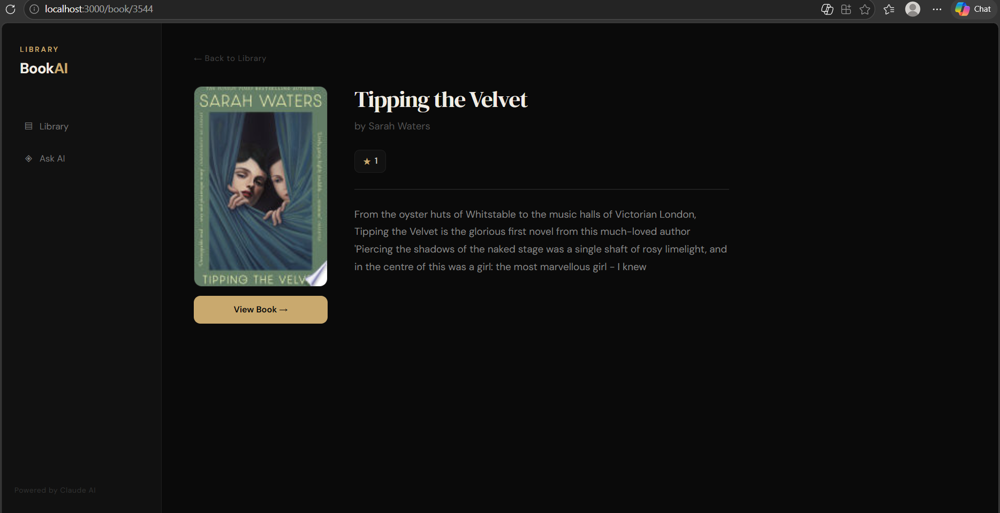

# 📚 Book AI Platform (RAG Based)

## 🚀 Project Overview

This is a full-stack AI-powered web application that enables users to explore books and ask intelligent questions using a **RAG (Retrieval-Augmented Generation)** system.

The system collects book data through web scraping, stores it in a database, and uses AI to generate insights such as summaries, genre classification, and smart recommendations.

---

## 🧠 Features

### 📌 Backend (Django REST Framework)

* Automated book scraping from web sources
* Structured data storage in database
* REST API endpoints for all operations
* RAG pipeline using embeddings and vector search

#### 🤖 AI Capabilities

* Summary generation
* Genre classification
* Smart recommendations
* Context-based question answering with source citations

---

### 🎯 Frontend (React + Tailwind CSS)

* 📊 Dashboard (Book listing)
* 🤖 Ask AI (Q&A interface)
* 📖 Book Detail Page
* Responsive and clean UI

---

## ⚙️ Tech Stack

| Layer      | Technology                               |
| ---------- | ---------------------------------------- |
| Backend    | Django REST Framework                    |
| Frontend   | ReactJS + Tailwind CSS                   |
| Database   | SQLite                                   |
| Vector DB  | ChromaDB                                 |
| Embeddings | Sentence Transformers                    |
| LLM        | LM Studio (Mistral 7B - local inference) |

---

## 🕷️ Data Collection (Automation)

The system uses automated scraping to collect book data from online sources.

* Implemented using Python scripts
* Extracts title, author, rating, description, and image
* Stores structured data in database

---

## 🤖 LLM Integration (IMPORTANT 🔥)

This project uses **LM Studio** to run a local Large Language Model (LLM) without external APIs.

* Model used: **Mistral 7B Instruct**
* Runs locally via `http://127.0.0.1:1234`
* No API key required
* Ensures **data privacy + zero cost**

The LLM is used to:

* Generate explanations for recommended books
* Answer user queries intelligently
* Enhance RAG responses with natural language

---

## 🔗 API Documentation

### 📥 GET

* `/api/books/` → Fetch all books
* `/api/book/<id>/` → Get book details
* `/api/recommend/` → Get recommended books

### 📤 POST

* `/api/upload/` → Scrape and index books
* `/api/ask/` → Ask AI-based questions

---

### 🔌 Sample Request

POST /api/ask/

```json
{
  "question": "romantic books"
}
```

### 🔌 Sample Response

```json
{
  "answer": "Here are some recommended books...\n\n📚 Sources:\n- Book1\n- Book2",
  "books": [...]
}
```

---

## 🤖 RAG Pipeline

1. Split book descriptions into smaller chunks
2. Generate embeddings using Sentence Transformers
3. Store embeddings in ChromaDB
4. Convert user query into embedding
5. Perform similarity search
6. Retrieve relevant book context
7. Generate answer using LLM
8. Display answer with **source citations**

---

## 🗃️ Database Schema

### Books Table

| Field       | Description       |
| ----------- | ----------------- |
| id          | Unique identifier |
| title       | Book title        |
| author      | Author name       |
| description | Book description  |
| rating      | Book rating       |
| image_url   | Cover image       |

---

## 🧪 Sample Q&A

**Q:** romantic books
**A:** Recommends romance-related books with explanation and sources

**Q:** history books
**A:** Returns context-based recommendations using RAG

**Q:** titanic
**A:** AI-generated answer even without direct match

---

## 🧪 Testing Samples

Try the following inputs in the Ask AI page:

* love
* mystery
* history
* money
* self improvement

The system will return:

* Recommended books
* AI-generated explanation
* Source citations

---

## 📦 Requirements

All dependencies are listed in `requirements.txt`.

Install using:

```bash
pip install -r requirements.txt
```

---

## ⚙️ Setup Instructions

### 🔹 Backend

```bash
cd backend
pip install -r requirements.txt
python manage.py runserver
```

### 🔹 Frontend

```bash
cd frontend
npm install
npm start
```

---

## 📸 Screenshots





---

## 📁 Project Structure

```
book-ai-platform/
│
├── backend/
│   ├── backend/
│   ├── books/
│   │   ├── models.py
│   │   ├── views.py
│   │   ├── scraper.py
│   │   ├── rag.py
│   │   └── urls.py
│   ├── db.sqlite3
│   ├── manage.py
│   └── requirements.txt
│
├── frontend/
│   ├── src/
│   │   ├── components/
│   │   │   ├── Dashboard.js
│   │   │   ├── Ask.js
│   │   │   └── BookDetail.js
│   │   ├── App.js
│   │   └── index.js
│   ├── package.json
│   └── tailwind.config.js
│
├── screenshots/
│   ├── dashboard.png
│   ├── ask.png
│   └── detail.png
│
├── README.md
└── .gitignore
```

---

## 💡 Future Improvements

* Chat history support
* Faster inference with optimized models
* Advanced semantic chunking
* UI improvements and animations

---

## 👨‍💻 Author

**Vinothkumar**
